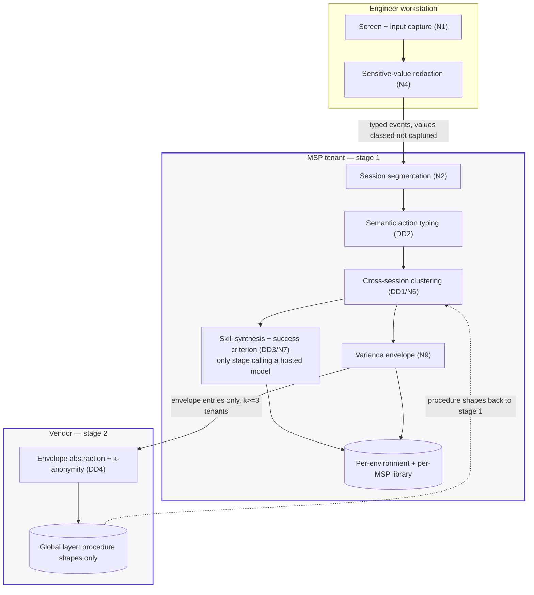

# D01 · Capture-to-skill pipeline

> **What this is** — the capture-to-skill pipeline, stage by stage, with the boundary each stage sits inside.
> **Why it exists** — the pack's central privacy claim (D6) is only checkable if every stage is placed on one side of a line. Drawn wrong, a reviewer discovers the model-provider hop themselves — which is exactly what happened to the first version of this set.
> **How to read it** — count the arrows crossing a boundary; there are two, and both carry a labelled payload. Attack the dotted inbound arrow, which is the one nobody inspects.
> **Depends on / feeds** — inherits [../deep_dives.md](../deep_dives.md) DD1–DD4; feeds [D06.md](D06.md), [../not_vaporware.md](../not_vaporware.md).

**What a reviewer should notice.** Only two arrows cross a boundary, and both are labelled with their payload. Raw frames never leave the workstation as frames — redaction (N4) runs *before* transport, so the pipeline is not "capture then clean" but "clean at capture". The dotted return arrow is the compounding: global procedure shapes flow back *into* stage-1 clustering. **Read the index carefully — it is customer-indexed, not environment-indexed.** It is how *customer 10's* first environment starts warmer than *customer 1's* first environment (M5 in the whitepaper). It does **not** make any given customer's first environment cheaper than doing nothing; that one is still worse than baseline, because the mechanical setup is unchanged and review work is added (A8, and whitepaper §4.1). If that arrow carried anything tenant-specific, D6's guarantee would be broken in the direction nobody inspects — inbound.
