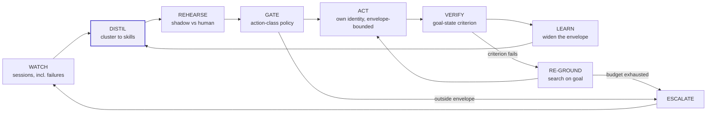

# D02 · The closed loop

> **What this is** — the closed loop as a circuit, with what breaks if any link is cut.
> **Why it exists** — the product's differentiation is the circuit, not any component — every part exists somewhere else. This diagram is where that claim is checkable rather than asserted.
> **How to read it** — trace the escalation path back into WATCH; a human resolving what the agent could not is the only source of the failure branches successful runs never contain.
> **Depends on / feeds** — inherits [../../product/PRD.md](../../product/PRD.md) §1; feeds [D10.md](D10.md), `visuals/`.

**What a reviewer should notice.** The escalation path feeds back into WATCH — a human resolving what the agent could not is itself a captured session, and it is the only source of the failure branches that successful runs never contain (`P2`). Cut any link and the system degrades to something that already exists: without VERIFY there is no RE-GROUND and the product is RPA with better parsing; without LEARN the library grows but never hardens. **DISTIL is shaded because it is the unevidenced step** — everything else is engineering.
