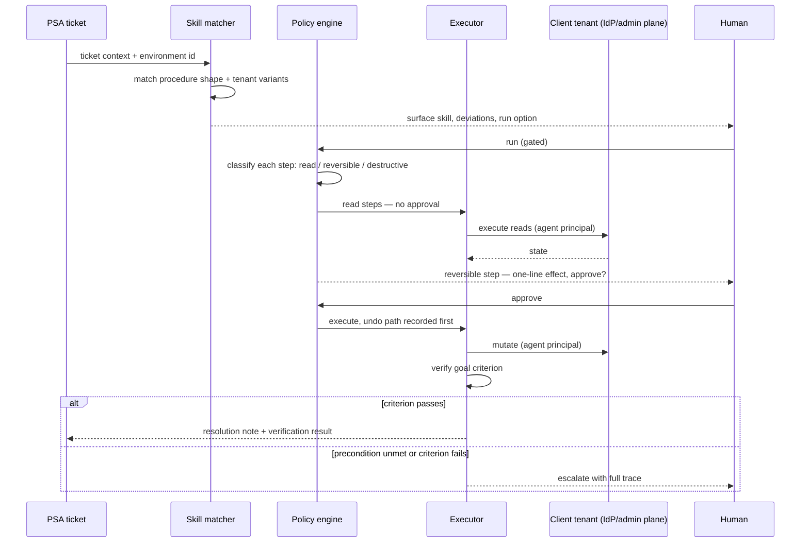

# D03 · Execution orchestration

> **What this is** — what actually runs when a skill fires against a ticket, as a sequence.
> **Why it exists** — the 14:20 incident turned on one ordering detail — whether the undo path is recorded before or after the mutation. A sequence diagram is where that ordering is visible and arguable.
> **How to read it** — look for what is absent: there is no path from matcher to executor that bypasses the policy engine.
> **Depends on / feeds** — inherits [../techniques/decision_tree.md](../techniques/decision_tree.md); feeds [D10.md](D10.md), `product/journeys/`.

**What a reviewer should notice.** The undo path is recorded **before** the mutation, not derived after it — that ordering is what made the 14:20 incident a 40-second recovery. Every action reaches the client tenant under the agent's own principal, never a shared admin account, so the client's audit log attributes it without our help. Note what the diagram does *not* contain: any path from matcher to executor that bypasses the policy engine.
