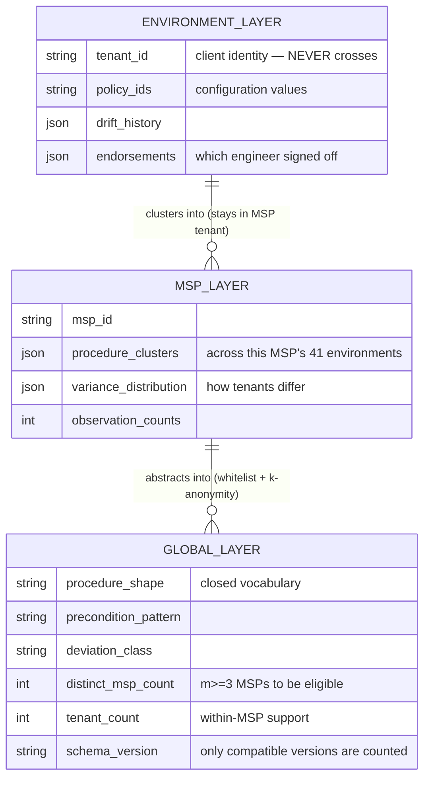

# D04 · Three-layer library schema

**What a reviewer should notice.** The middle layer is the one the first design omitted, and it is where the customer's own compounding happens — an MSP's 41 environments clustering together, inside its own tenant, crossing no new trust boundary because it already administers all of them. The global layer's fields are a **closed vocabulary**: it cannot express a tenant name because there is no field for one (DD4's whitelist construction). **The threshold was corrected after critic round 1 and it counts MSPs, not tenants.** The first version required a pattern to be seen in ≥3 *client tenants* — but one MSP brings ~41 of them, so all three observations could sit inside a single design partner's book and the envelope would identify that MSP with certainty. It now requires **≥3 distinct MSPs**, which lengthens the cold start considerably and is the correct trade. `schema_version` exists because entries produced by different abstraction implementations are not comparable, and counting across them corrupts the guarantee silently (D09).

**And the guarantee is heuristic, not formal** — minimum support does not address compositional linkage across entries, and no l-diversity, t-closeness or differential privacy is implemented. See DD4.
