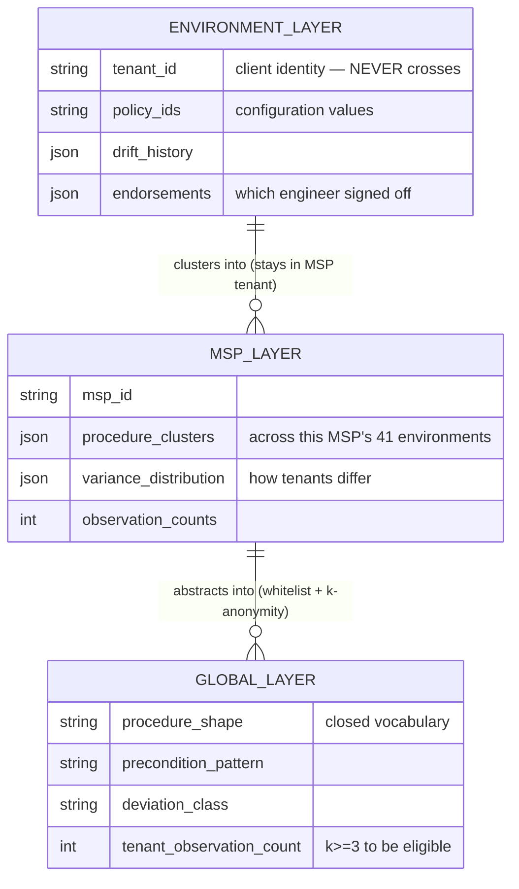

# D04 · Three-layer library schema

**What a reviewer should notice.** The middle layer is the one the first design omitted, and it is where the customer's own compounding happens — an MSP's 41 environments clustering together, inside its own tenant, crossing no new trust boundary because it already administers all of them. The global layer's fields are a **closed vocabulary**: it cannot express a tenant name because there is no field for one (DD4's whitelist construction). The `k>=3` threshold is the actual guarantee — a deviation seen in one tenant is a fingerprint, and does not cross.
