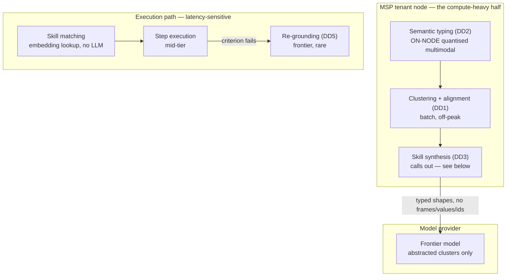

# D05 · Inference routing and cost control

**What a reviewer should notice.** **Semantic typing runs on the node, not against an API** — this is forced by D6, since frames of a client's admin console reaching a hosted provider would break the guarantee. It costs a GPU in the reference node and some accuracy. **Skill synthesis is the single outbound inference call**, on abstracted clusters only. Distillation is batch and tolerates off-peak scheduling; execution is interactive and cannot. The expensive stages are **batch**, which is what makes edge inference affordable — distillation can run overnight on the MSP's own hardware rather than competing for interactive capacity. Skill matching deliberately uses no LLM at all: it is an embedding lookup, because it runs on every ticket and is the one path where cost scales with the customer's volume. D6 moved this compute to hardware we do not own, so the per-node hardware floor is a **commercial term in the MSP contract**, not just an engineering parameter — `financials/unit_economics.md` owes both sides of it.
