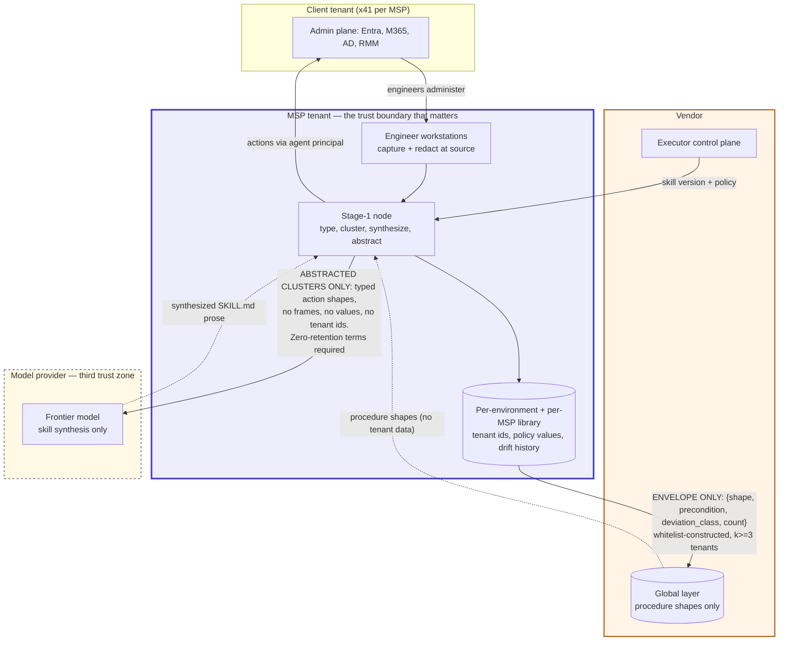

# D06 · The two-stage boundary — the privacy architecture

**What a reviewer should notice — this is the diagram the security review is about.**

1. **Raw sessions exist in exactly one place:** the MSP tenant. They are redacted at the workstation before transport and never appear in the vendor boundary in any form.
2. **One arrow crosses into the vendor**, and its label is the entire privacy claim. If an envelope entry could carry a tenant name, a domain, a user, a policy id or a configuration value, that arrow would be a data-transfer path and the review becomes the kind that stalls for months. It cannot, because the global schema has no field for any of them (D04) and because a deviation must be observed in **k≥3 distinct tenants** before it is eligible to cross — a pattern seen once is a fingerprint.
3. **The client tenant hosts nothing.** No node, no agent, no storage. A 22-person practice on SaaS has no perimeter to host anything in, which is what made the original per-client framing unimplementable.
4. **The inbound dotted arrow deserves the same scrutiny as the outbound one.** Procedure shapes flow back from global into stage-1 clustering; that is the compounding mechanism (A8). An inbound path is the one nobody inspects, and it is equally capable of carrying tenant data if the schema is sloppy.
5. **Actions reach the client under the agent's own principal**, originating from the MSP node — the same administrative relationship the MSP already has, not a new one from the vendor.
6. **The model provider is a third trust zone, and the first version of this diagram omitted it entirely** — which meant the diagram titled "the diagram the security review is about" did not answer the first question a security review asks, the sub-processor list. Two stages could have called a hosted model. **Action typing now runs on the node** (`not_vaporware.md` §2b), because frames of a client's admin console reaching a third party would break claim 1 outright. **Skill synthesis remains hosted and is the system's only outbound inference call**, and it operates on already-abstracted clusters — typed action shapes with no frames, no values and no tenant identifiers — so it carries no client data by construction. Zero-retention and no-training terms are an architecture requirement here, not a procurement preference.
