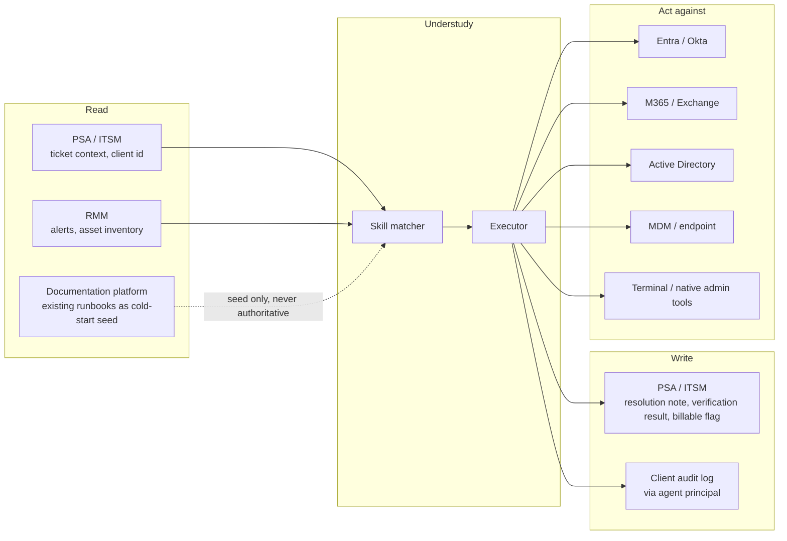

# D07 · Integration surface

**What a reviewer should notice.** The documentation platform is a **dotted, seed-only** input: existing runbooks help a cold start but are never authoritative, because they are the stale artifact this product exists to replace — treating them as truth would import the decay it is meant to break. The RMM alert path matters commercially, not just technically: alert-triggered tickets have deterministic triggers and documented remediation, which `strategy/market_sizing.md` row 8 flags as possibly the most mechanisable segment of an MSP queue and therefore the place the 25% automatable assumption may be conservative. Note I5 — terminals and native tools are where browser-only competitors stop [S25], and where DD2's accessibility-tree approach degrades to vision.
