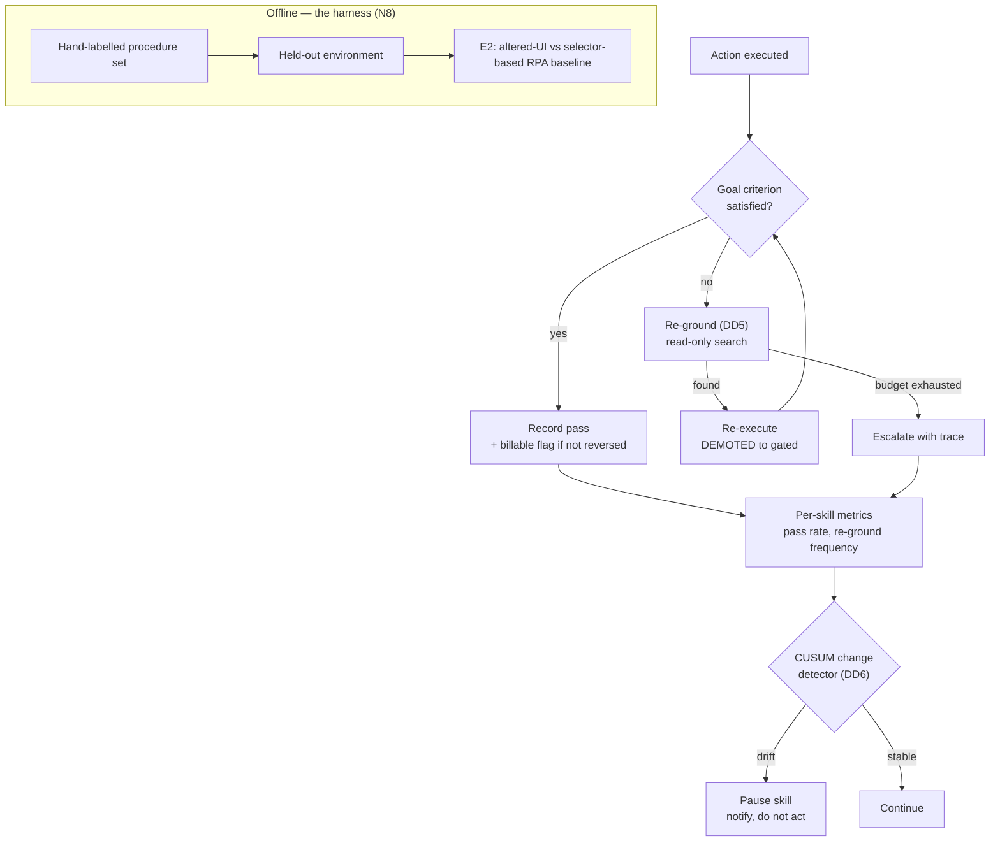

# D08 · Verification, drift and evaluation

**What a reviewer should notice.** Re-grounding **demotes the run to gated** regardless of the skill's promotion rung, so a human sees the first execution after any interface change — this is the mitigation for DD5's worst failure, re-grounding onto a similar-but-wrong control. The offline harness is drawn separately and deliberately: it must exist *before* DD1 is tuned, or the system grades its own homework against metrics chosen by the person optimising them. E2 is inside the harness rather than bolted on, because the RPA argument (§5 of the whitepaper) is a claim this system makes about itself and therefore has to be measured by the same apparatus.
