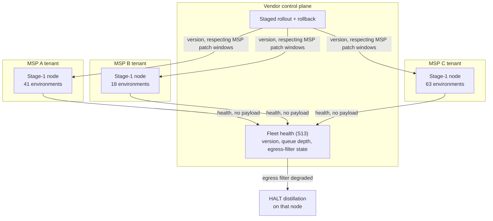

# D09 · Node fleet across MSPs

**What a reviewer should notice.** **One node per MSP, not one per client** — this is the operational consequence of the corrected D6 boundary, and it is the difference between three nodes for three design partners and roughly 123. At one-per-client the fleet would have exceeded what a solo founder can operate before the first paid pilot.

Two things the diagram makes explicit that the feature list would not: nodes report **health only, never payload**, so the control plane cannot become a back door around the boundary; and a degraded egress filter **halts distillation** rather than continuing and reconciling later — a filter that is not verifiably working turns D6's guarantee into a claim, and the correct behaviour is to stop. Note also that rollout respects the MSP's own patch windows: this is a component inside someone else's infrastructure, and treating it otherwise is how a vendor becomes an operational liability to its customer.
