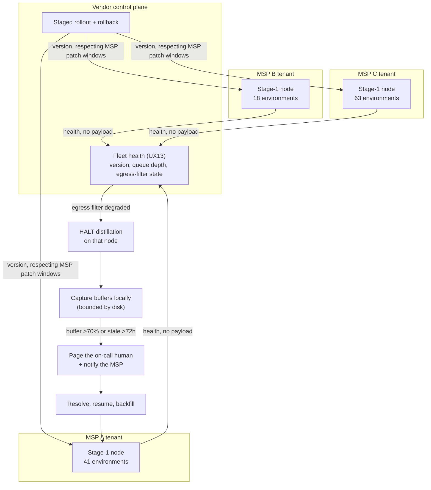

# D09 · Node fleet across MSPs

> **What this is** — the node fleet across MSP tenants, and the operational obligation D6 creates.
> **Why it exists** — the corrected boundary is the difference between three nodes for three design partners and roughly 123. At one node per client the fleet would exceed what a solo founder can operate before the first paid pilot.
> **How to read it** — look at what HALT leads to; a terminal HALT with no responder was the first version's error, and version skew silently corrupts the m≥3 count without a schema rule.
> **Depends on / feeds** — inherits decision D6, [D04.md](D04.md); feeds `product/features_prioritized.md` N15, `product/ux_spec.md` UX13.

**What a reviewer should notice.** **One node per MSP, not one per client** — this is the operational consequence of the corrected D6 boundary, and it is the difference between three nodes for three design partners and roughly 123. At one-per-client the fleet would have exceeded what a solo founder can operate before the first paid pilot.

**Version skew is a correctness problem, not an inventory field.** With MSP A on v3 and MSP C on v1, D04's `tenant_observation_count` would be counting envelope entries produced by two different abstraction implementations. **Every envelope entry therefore carries a schema version, and the m≥3 threshold counts only entries produced by compatible versions** — a rule that did not exist in the first version of this diagram and that quietly corrupts the privacy guarantee without it.

**HALT is not a terminal state.** The first version drew it as one, with no responder and no answer to what happens to capture in the meantime. Capture buffers locally against node disk; a buffer above 70% or a skill stale beyond 72 hours pages a human and notifies the MSP. `(assumption: thresholds owed to the first pilot)`. **For a solo founder this is the on-call obligation the company acquires on its first deployment**, and `not_vaporware.md` previously filed node lifecycle under "low uncertainty, tedious rather than uncertain" while the product layer called N15 "the item most likely to be underestimated" — the product layer was right.

Two further things the diagram makes explicit that the feature list would not: nodes report **health only, never payload**, so the control plane cannot become a back door around the boundary; and a degraded egress filter **halts distillation** rather than continuing and reconciling later — a filter that is not verifiably working turns D6's guarantee into a claim, and the correct behaviour is to stop. Note also that rollout respects the MSP's own patch windows: this is a component inside someone else's infrastructure, and treating it otherwise is how a vendor becomes an operational liability to its customer.
