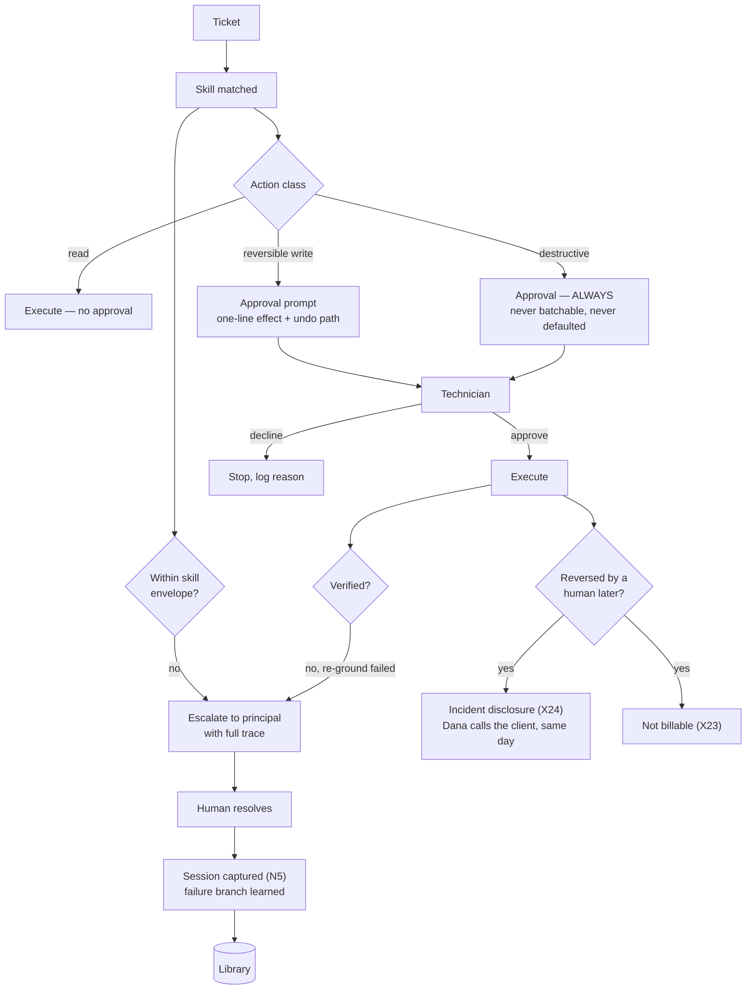

# D10 · Human-in-the-loop and escalation

**What a reviewer should notice.** There are **four** distinct paths to a human, and they are not the same path: approval (before a mutating action), envelope escalation (the situation is outside what the skill has seen), verification escalation (the action ran and could not be confirmed), and **post-hoc reversal** — the 14:20 case, where everything passed and the decision was still wrong.

That fourth path is the one most systems omit, and it carries two obligations the product must own: a **same-day disclosure to the client's IT owner**, because a veto-holder who hears it secondhand reopens a six-week review, and a **billing consequence** — a resolution that a human reversed within the ticket's life is not billable, which is the clause that keeps outcome pricing alive past month three.

Note the loop at the bottom left: escalations become captured sessions. The human resolving what the agent could not is the system's only source of failure branches (`P2`), so escalation is an input, not just an exit.
