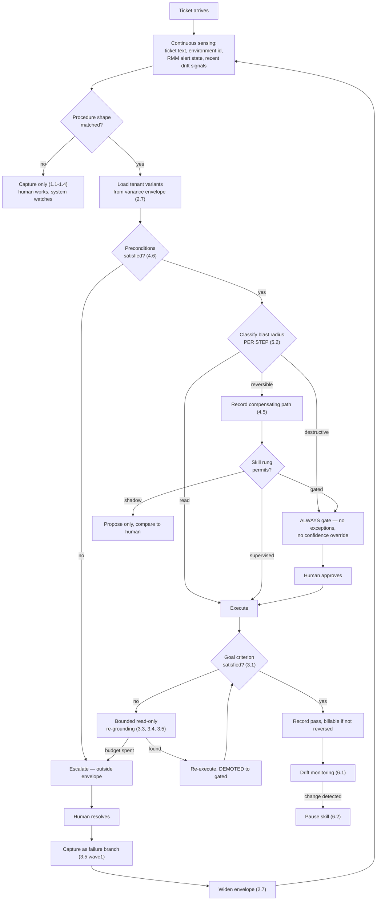

# Technique decision tree — what fires, when, in what order

> **What this is** — the runtime logic: which techniques fire on which signals, in what priority, and how the system continuously re-evaluates rather than deciding once.
> **Why it exists** — a technique catalogue is inert. This file is what turns 73 listed methods into a system, and it is where the safety ordering is made explicit: **classification before capability**, always. A system that decides what it *can* do before deciding what it is *allowed* to do has the ordering backwards, and that is how automation causes incidents.
> **How to read it** — the flowchart is the control flow; the logic table is the contract. A skeptic should attack the triage ordering in §2 — specifically whether "destructive" can ever be downgraded by confidence (it cannot).
> **Depends on / feeds** — inherits [wave1.md](wave1.md), [wave2.md](wave2.md), [../deep_dives.md](../deep_dives.md); feeds [technique_feature_matrix.md](technique_feature_matrix.md), [../architecture/D10.md](../architecture/D10.md), `visuals/`.

## 1 · The runtime tree

## 2 · Priority triage — the ordering that matters

Evaluated top to bottom. **A lower rule never overrides a higher one.**

| Priority | Condition | Action | Why it outranks what follows |
|---|---|---|---|
| **1** | Step is destructive | Gate. Always. | Irreversibility beats every other consideration, including a perfect track record. **Confidence never downgrades this class** — a system that is right 200 times is not thereby permitted to delete a mailbox unattended |
| **2** | Preconditions unmet | Escalate | The situation is outside what the skill has seen; improvising here is exactly the over-merge failure DD1 warns about |
| **3** | Skill is paused by drift | Do not execute | A skill whose verification is degrading is a wrong action waiting for a trigger |
| **4** | Re-grounding occurred this run | Demote to gated | The interface changed; the first execution after a change is seen by a human |
| **5** | Skill rung is shadow | Propose, never act | Trust is earned on evidence, not asserted |
| **6** | Step is reversible | Record undo path, then gate per rung | Compensation before mutation, never after |
| **7** | Step is read | Execute freely | No blast radius |

**The ordering is the safety argument.** Classification (rule 1) precedes capability (rules 5–7), so no amount of demonstrated competence unlocks a destructive action. Automation bias makes this ordering more important over time, not less: the approver who has cleared 200 correct proposals reads the 201st less carefully [S35][S36], so the system must not rely on approval quality that it is itself eroding.

## 3 · Continuous re-evaluation

Three signals re-open a decision the system already made:

| Signal | Technique | Consequence |
|---|---|---|
| Verification pass rate falls | 6.1 CUSUM | Skill paused before it acts wrongly |
| Re-grounding frequency rises | DD5 telemetry | Interface drift suspected; canary the skill (6.2) |
| A human reverses a verified action | X23 ledger | **The 14:20 class.** Not billable; envelope widened; disclosure to the client owner (X24) |

The third has no automated detector — it is discovered when a human acts. That is a genuine gap, and the mitigation is organisational rather than technical: the reversal path is instrumented so that when it happens, the consequences are automatic even though the detection is not.

## 4 · What the tree deliberately cannot do

- **Downgrade a destructive classification on confidence.** No path exists.
- **Act on a paused skill.** No override, including by a human in a hurry — un-pausing is an explicit review action.
- **Mutate during re-grounding.** Read-only, enforced at the executor.
- **Promote itself.** Rung changes require declared evidence and a human decision (X10); the system does not lobby for its own autonomy.

**Recommended next 3:** (1) implement rules 1–3 before any execution feature ships, since they are the entire safety argument and are cheap while the executor is still a stub; (2) instrument rule 4's demotion, because DD5's worst failure — re-grounding onto a similar-but-wrong control — is invisible without it; (3) build the X23 reversal ledger early: it is both the billing rule and the only detector for the failure class no verification catches.
